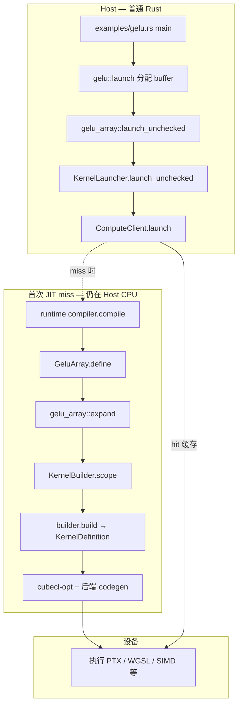

# CubeCL 专题 · 第一章：用 GELU 走通一条 launch——Host 上的 Rust 与设备上的 kernel 是两层世界

> **本章锚点**：CubeCL 仓库里的官方示例 `cubecl/examples/gelu/`。  
> **GELU** 是逐元素的激活函数；**`gelu_array`** 是示例里 kernel 的函数名（不是 Burn 里的模块名）。你写的 `gelu_array` 看起来像普通 Rust，但它使用 CubeCL 前端类型（`Vector`、`ABSOLUTE_POS`），**不能**在 `main` 里直接调用。Host 侧应调用宏生成的 **`gelu_array::launch_unchecked`**；设备代码在**首次 launch** 时才 JIT 编译。

> **读者提示**：*kernel* / *JIT* 等术语见 [JIT 编译管线](jit-compilation-pipeline.md)。专题写作计划见 [index.md](index.md#入门引导gpu--cubecl-新人必读)（已归档）。

---

## 本章在系列中的位置

| 文档 | 你得到什么 |
|------|------------|
| [index.md · 入门引导](index.md#入门引导gpu--cubecl-新人必读) | GELU 示例是什么、建议阅读顺序 |
| [summary.md](summary.md) | 编译器全景（可先略读，遇词再查表） |
| **本章** | 跟跑 gelu 示例，看清 launch → `define()` → `expand` |
| [cubecl-book · Getting Started](cubecl/cubecl-book/src/getting-started/summary.md) | 并行练习 reduction（教写 kernel，不教宏展开） |

读完本章，你应该能解释：**为什么不能直接调 `gelu_scalar`**；**`CubeDim::new_1d(1)` 与 `vector_size=4` 如何对应 4 个元素**；**`GeluArray::new` 与 `expand` 谁何时被调用**。

---

## 一分钟跑通：同一份内核，三种 runtime

在 `cubecl` 仓库根目录，**每次只选一个 feature 编译运行**（不是一次命令跑三个后端）：

```bash
cd cubecl
cargo run --example gelu --features cpu   # MLIR → LLVM JIT → 本机 SIMD
cargo run --example gelu --features cuda  # NVRTC → PTX（需 NVIDIA 环境）
cargo run --example gelu --features wgpu  # WGSL / Metal / Vulkan 等由 wgpu 选择
```

`examples/gelu/Cargo.toml`：

```toml
[features]
wgpu = ["cubecl/wgpu"]
cuda = ["cubecl/cuda"]
cpu = ["cubecl/cpu"]
```

入口 `examples/gelu/examples/gelu.rs` 用 `#[cfg(feature = …)]` 选择 `Runtime`，再调用库里的 host 函数 `gelu::launch`：

```rust
#[cfg(feature = "cpu")]
gelu::launch::<cubecl::cpu::CpuRuntime>(&Default::default());
// cuda / wgpu 同理
```

**变的是** `R: Runtime` 与链接的后端；**不变的是** `lib.rs` 里的 `gelu_array` / `gelu_scalar` 源码。

---

## 两层世界：调用链总图

CubeCL 把 **Host 调度** 与 **kernel 编译** 分开。注意：`launch_unchecked` **不会**直接调用 `expand`；中间经过 `KernelLauncher`、`ComputeClient` 和 runtime 的 `compile`。



要点：

- **你写的** `fn gelu_array(...)`：保留给 Rust 类型检查；宏另生成 `expand` 与 `GeluArray`（下节）。
- **你调的** `launch_unchecked`：创建 `GeluArray::new(...)`（只存 settings、client、参数），交给 launcher。
- **expand 时机**：runtime 在 `kernel.define()` 里执行（`generate/kernel.rs` 中 `CubeKernel::define` → `define_body`）。

---

## 读 kernel：`gelu_array` 在算什么

`cubecl/examples/gelu/src/lib.rs`：

```rust
#[cube(launch_unchecked)]
fn gelu_array<F: Float, N: Size>(input: &[Vector<F, N>], output: &mut [Vector<F, N>]) {
    if ABSOLUTE_POS < input.len() {
        output[ABSOLUTE_POS] = gelu_scalar(input[ABSOLUTE_POS]);
    }
}

#[cube]
fn gelu_scalar<F: Float, N: Size>(x: Vector<F, N>) -> Vector<F, N> {
    let sqrt2 = F::new(comptime!(2.0f32.sqrt()));
    let tmp = x / Vector::new(sqrt2);
    x * (Vector::erf(tmp) + Vector::one()) / Vector::new(F::new(2.0f32))
}
```

- **`gelu_array`**：每个并行 **unit** 根据全局下标 `ABSOLUTE_POS` 读写一个 `Vector` 槽位（elementwise）。
- **`gelu_scalar`**：GELU 公式的具体计算；被上层 kernel 调用，自身不带 `launch`。

### `ABSOLUTE_POS`

内置拓扑变量（`cubecl-core/src/frontend/topology.rs` → `Builtin::AbsolutePos`）。可理解为「我在整个 launch 里是第几个元素」，无需手写 `blockIdx * blockDim + threadIdx`。

### `Vector<F, N>` 与 `vector_size`

`Vector` 表示一个 unit 上一次处理 **N** 个标量。Host 在 launch 时传入 `vector_size`（本例为 4），参与 JIT 特化（详见 [专题第七章 §7.1](index.md#第七章待写一章两节)）。

### `comptime!`

在 **expand 执行时**于 host 求值并写入 IR 常量，不是 `cargo build` 的 `const`。专题第四章展开。

---

## `#[cube(launch)]` 到底生成了什么——宏展开产物的结构

理解两层世界的直接方式是**看 proc-macro 的实际输出**。`#[cube(launch)] fn gelu_array` 被宏展开为一个 Rust 模块，结构如下（简化，完整展开见 `cargo expand` 输出）：

```rust
pub mod gelu_array {
    use super::*;

    // 1. 保留原始函数（用于 Rust 类型检查）
    #[allow(unused)]
    fn gelu_array<F: Float>(input: &[Vector<F, N>], output: &mut [Vector<F, N>]) {
        if ABSOLUTE_POS < input.len() {
            output[ABSOLUTE_POS] = gelu_scalar(input[ABSOLUTE_POS]);
        }
    }

    // 2. 生成 expand 函数（重写参数签名为 ExpandType）
    #[allow(unused, clippy::all)]
    fn expand<F: Float>(
        scope: &Scope,
        input: <Array<Vector<F,N>> as CubeType>::ExpandType,
        output: <Array<Vector<F,N>> as CubeType>::ExpandType,
    ) {
        // 原函数体中的 + → __expand_add_method(scope, ...)
        // 原函数体中的 if → branch::if_expand(scope, ...)
        // 原函数体中的 ABSOLUTE_POS → 内建值 Builtin::AbsolutePos
    }

    // 3. Kernel 结构体（实现 CubeKernel trait）
    pub struct GeluArray<F: Float, R: Runtime> {
        settings: KernelSettings,
        args: (/* 每个参数的 BufferCompilationArg */),
        debug_name: Option<&'static str>,
    }

    // 4. Kernel trait 实现（提供 define() 和 id()）
    impl<F: Float, R: Runtime> CubeKernel for GeluArray<F, R> {
        fn define(&self) -> KernelDefinition {
            let mut scope = Scope::new(/* ... */);
            // 注册 buffer 参数
            expand::<F>(&scope, /* input_expand, output_expand */);
            // builder.build(scope) → KernelDefinition
        }
        fn id(&self) -> KernelId {
            KernelId::new::<Self>()  // 参与 JIT 缓存 key
        }
    }

    // 5. launch 入口
    pub fn launch<F: Float, R: Runtime>(
        client: &ComputeClient<R>,
        cube_count: CubeCount,
        cube_dim: CubeDim,
        input: BufferArg<R>,   // ← 每个 buffer 参数对应一个
        output: BufferArg<R>,
    ) {
        let kernel = GeluArray::new(settings, client, input, output);
        KernelLauncher::launch(kernel, client, cube_count, cube_dim, /* ... */);
    }

    // 6. launch_unchecked（跳过向量化等安全检查）
    pub unsafe fn launch_unchecked<F: Float, R: Runtime>(
        client: &ComputeClient<R>,
        cube_count: CubeCount,
        cube_dim: CubeDim,
        // ... buffer 参数 ...
    ) { /* 同上但跳过安全验证 */ }
}
```

模块内部六个组件各有不同的时机：

| 组件 | 编译/运行时机 | 用途 |
|------|-------------|------|
| 原始函数 | `cargo build`（类型检查） | 确保 kernel 写法合法 |
| `expand` | 首次 JIT miss（host CPU 执行） | 填 `Scope`，生成 IR |
| `GeluArray` struct | `cargo build`（类型生成） | 包装 settings + buffer 参数 |
| `define()` | 首次 JIT miss（调用 expand → scope → build） | 生成 `KernelDefinition` |
| `launch` | 每次 host 调用 | 入口点，创建 KernelLauncher |
| `launch_unchecked` | 每次 host 调用 | 跳过安全检查的版本 |

最关键的观察：**`gelu_array` 的原始函数体（第 1 部分）** 被保留但**从未在运行时被调用**——它的存在仅为 Rust 类型检查。真正被执行的是 **`expand` 函数（第 2 部分）**，它在 JIT 时运行，把操作记录到 `Scope`。这是 CubeCL "你写的是 IR 生成器" 的具体体现。

> 跟练：在 cubecl 仓库中运行 `cargo expand --example gelu`（需 nightly）查看完整宏展开产物。完整展开含类型别名、泛型约束、`KernelSettings` 的详细字段等，比上述简化版长约 10 倍。产出存档于 [docs/artifacts/](../artifacts/README.md)（待跟练验证后补充）。

---

## 读 host：`launch` 如何把数据交给 kernel

```rust
pub fn launch<R: Runtime>(device: &R::Device) {
    let client = R::client(device);
    let input = &[-1., 0., 1., 5.];
    let vector_size = 4;
    // ...
    unsafe {
        gelu_array::launch_unchecked::<f32, R>(
            &client,
            CubeCount::Static(1, 1, 1),
            CubeDim::new_1d(input.len() as u32 / vector_size as u32),
            vector_size,
            BufferArg::from_raw_parts(input_handle, input.len()),
            BufferArg::from_raw_parts(output_handle.clone(), input.len()),
        )
    };
    // read_one → println
}
```

| 步骤 | 代码 | 含义 |
|------|------|------|
| 客户端 | `R::client(device)` | 与具体后端通信的 `ComputeClient` |
| 缓冲 | `create_from_slice` / `empty` | 设备侧句柄，经 `BufferArg` 绑定 |
| 网格 | `CubeCount::Static(1, 1, 1)` | 1 个 cube（≈ 一个 CUDA grid） |
| 块大小 | `CubeDim::new_1d(1)` | `len=4`，`vector_size=4` → **1 个 unit**（每 unit 一条 `Vector<f32,4>`） |
| 向量化 | 第 4 参数 `vector_size = 4` | 写入 `KernelSettings`，进入 JIT 键 |
| 执行 | `launch_unchecked` | 见下文调用链 |

源码对应：

```143:143:cubecl/examples/gelu/src/lib.rs
            CubeDim::new_1d(input.len() as u32 / vector_size as u32),
```

当 `input.len() == 4` 且 `vector_size == 4` 时，结果为 **`CubeDim::new_1d(1)`**，不是 `new_1d(4)`。

> **易错点**：`CubeDim` 统计的是 **unit 个数**；元素数 ≈ `cube_count × cube_dim × vector_size`（各轴相乘）。

### 为什么先用 `--features cpu`

无 GPU 也能走通 **launch → compile（miss）→ 执行 → 读回**；逻辑与 CUDA/WGPU 相同，仅最后 codegen 不同。

---

## `#[cube(launch_unchecked)]` 生成了什么

`cubecl-macros/src/generate/launch.rs` 展开为 **`mod gelu_array { … }`**，并把原函数体放进名为 **`expand`** 的函数。与 launch 相关的还有 **PascalCase 的 kernel 结构体**（本例 `GeluArray`），它实现 `CubeKernel`——这是连接 launch 与 JIT 的桥梁：

```rust
// 概念结构（省略泛型与辅助类型别名）
mod gelu_array {
    pub fn expand(scope: &mut Scope, /* … */) { /* 原 gelu_array 逻辑 → 填 IR */ }

    pub struct GeluArray { settings, client, /* compilation/comptime 字段 */ }

    impl GeluArray {
        pub fn new(settings, client, /* … */) -> Self { /* 只存储，不 expand */ }
    }

    impl CubeKernel for GeluArray {
        fn define(&self) -> KernelDefinition {
            // define_body 生成：KernelBuilder + expand + build
        }
    }

    pub fn launch_unchecked(client, cube_count, cube_dim, vector_size, buffers…) { /* … */ }
}
```

`GeluArray::new`（`kernel.rs` 约 402–414 行）**只保存** `KernelSettings`、`ComputeClient` 和编译期参数，**不调用** `expand`。

### `launch_unchecked` 里发生什么（`launch_body`）

1. 构造 `KernelSettings`（`cube_dim`、`address_type` 等）。
2. `KernelLauncher::new` → 注册 buffer / tensor 元数据。
3. `let kernel = GeluArray::new(settings, client, …)`。
4. `launcher.launch_unchecked(cube_count, kernel, client)` → `ComputeClient`。
5. 若 JIT 缓存 **miss**：compiler 对 `CubeKernel` 调用 **`kernel.define()`** → 内部才 `expand` + `builder.build()`。

### `define()` 里发生什么（`define_body`）

`generate/kernel.rs` 生成的逻辑比「只调 expand」多几步，这些 setup 影响后端能否选对指令与指针宽度：

```rust
let mut builder = KernelBuilder::default();
builder.runtime_properties(__R::target_properties());
builder.device_properties(self.client.properties());
// 泛型 / IO 映射：把 BufferArg 等注册进 builder
self.settings.address_type.register(&mut builder.scope);
expand(&mut builder.scope, /* 参数 */);
builder.build(self.settings.clone())  // → KernelDefinition（仍是 IR 级描述）
```

- **`expand`**：往 `builder.scope` 填 `Operation`（第二章讲 `+` 如何经 `__expand_*_method` 落到 Scope）。
- **`build`**：产出 **`KernelDefinition`**，交给 integrator；**还不是** PTX/WGSL。
- **真正编译**：runtime 对 `KernelDefinition` 跑 **`cubecl-opt`** 与各后端 codegen（第五章）。

### `launch` vs `launch_unchecked`

`launch_unchecked` 要求 kernel 内无越界读写、无不可终止循环，否则 UB。示例用 `unsafe` 换简短；生产环境在边界可证时用，否则用 `#[cube(launch)]`。

---

## 第一次 launch 的时间线（本章版）

```
1. gelu_array::launch_unchecked → KernelLauncher → ComputeClient::launch
2. 查 JIT 缓存键：(kernel id, comptime, vectorization, cube_dim, …)
3. miss → compiler.compile → GeluArray::define()
       → expand 填 Scope → builder.build() 得到 KernelDefinition
4. cubecl-opt 优化 + 后端 codegen（NVRTC/MLIR/Wgsl…）→ 写入 CompilationCache
5. 设备执行；同键再次 launch 跳过步骤 3–4
```

**区分**：步骤 3 的 `build` 产出 **IR 级 `KernelDefinition`**；步骤 4 才是「编译成 PTX/WGSL/本机码」。

---

## 常见误区

| 误区 | 事实 |
|------|------|
| 在 `main` 里直接 `gelu_scalar(x)` | 只能用 CubeCL 前端类型，走 `#[cube]` / expand 路径 |
| `GeluArray::new` 会触发 expand | **不会**；expand 在 **`define()`** 里，由 compile 路径触发 |
| `launch_unchecked` 直接调 expand | 经 **client → compiler → define()** 间接调用 |
| `CubeDim::new_1d(input.len())` | 应为 **`len / vector_size`**（本例 `new_1d(1)`） |
| `builder.build` = GPU 已编译完成 | 只到 **KernelDefinition**；opt + 后端在之后 |
| `cargo build` 生成 GPU 代码 | GPU 代码在 **首次 launch miss** 时生成 |
| 一次命令跑齐 cpu+cuda+wgpu | 需 **分别** `cargo run --features …` |

**预告**：CubeK 等复杂 kernel 常用 **`#[define(Lhs, Rhs, …)]`** 把 launch 泛型与类型映射注册进宏；gelu 未使用。见 [专题第三章](index.md#第三章待写新增) 与 [第二章](index.md#第二章待写)。

---

## 本章决策时机

本章覆盖的每项机制有明确的决策时机。把这个框架内化后，后续章节的机制才能放在正确的位置：

| 决策 | 时机 | 谁决定 |
|------|------|--------|
| `#[cube]` kernel 的 Rust 类型检查 | `cargo build` | rustc |
| expand 子模块的代码生成（`mod gelu_array { … }`） | `cargo build`（proc-macro 展开） | `cubecl-macros` |
| `KernelSettings`（cube_dim, vector_size, address_type） | launch 调用时 | 调用者（host 代码） |
| expand 执行——向 `Scope` 填 `Operation` | 首次 JIT miss 时（`define()` 内） | CubeCL runtime |
| `builder.build()` → `KernelDefinition` | 首次 JIT miss 时（`define()` 内） | `KernelBuilder` |
| cubecl-opt + 后端 codegen（PTX/WGSL/SIMD） | 首次 JIT miss 时（compile 路径） | `cubecl-opt` + 各后端 |
| 磁盘缓存命中 | 同 kernel 键的第二次 launch | `CompilationCache` |

**关键洞察**：你写的 `#[cube]` 函数体是**一段在 JIT 时运行的程序**——执行后向 `Scope` 填入 IR 指令，再由 `cubecl-opt` 和后端编译器处理。它在 `cargo build` 时不产生 GPU 代码，在首次 launch 时才以 IR 的形式表达计算意图。这解释了为什么 `comptime!` 可以在 kernel 里做 `2.0f32.sqrt()` —— 它是在 host CPU 上、JIT 编译时执行的普通 Rust 代码。

---

## 小结

1. **两层世界**：Host 负责 buffer 与 `launch_unchecked`；设备逻辑经 **`GeluArray::define()` → `expand` → `KernelDefinition` → opt/后端**。
2. **gelu 示例** 演示 GELU 公式、`ABSOLUTE_POS` elementwise、以及 `CubeDim` 与 `vector_size` 的配合。
3. **宏产物** 关键是 **`mod gelu_array` + `GeluArray: CubeKernel`**，不是「Rust 源码直接变 PTX」。

---

## 作业

> 可运行骨架见 [src/ch1-gelu-variants/src/lib.rs](../../src/ch1-gelu-variants/src/lib.rs)。`cd src/ch1-gelu-variants && cargo test -- --nocapture` 即可运行。

1. `input` 改为 8 个元素，分别设 `vector_size = 1` 与 `4`，推导 `CubeDim::new_1d(...)`，用 `--features cpu` 验证。
2. 在 `gelu_scalar` 里加 `comptime!` 常量，观察无需改 launch 签名即可重跑；对比「增加 `#[comptime] bool` launch 参数」对缓存键的影响（预告第四章）。

---

## 下章预告

**[第二章 · expand：`+` 如何变成 `__expand_add_method`](2-expand.md)**：表达式经 **`IntoExpand` / `NativeExpand` 两层方法** 再写入 `Scope`——parse 层（Rust AST → `Expression` 枚举）→ generate 层（`Expression` → `__expand_*_method`）。跟读 `cubecl-macros/src/generate/expression.rs`。

---

> **回头看一眼**：你用同一份 `gelu_array` 源码，在三种 runtime 上跑出了相同结果。拆开看：三套完全不同的编译路径——MLIR→LLVM SIMD（CPU）、NVRTC→PTX（CUDA）、WGSL→Metal/SPIR-V（wgpu）——输入同一份 Rust 源码，输出同一个计算结果。PyTorch 生态里没有直接对应物：CUDA kernel 跑不到 TPU，XLA kernel 跑不到 Metal。CubeCL 解决的部署问题是：**当你需要同一套 kernel 逻辑跑在手机、笔记本、边缘盒子和服务器 GPU 上时，不需要为每个平台维护一套平台相关的实现。**（不评价它比 PyTorch/Triton "更好"——不同工具为不同场景设计。）
>
> 接下来的章节展开这个能力的内部机制。

---

## 系列导航

| 篇 | 文档 |
|:---:|------|
| 地图 | [summary.md](summary.md) |
| 计划 | [index.md](index.md) |
| **专题 1** | **本文** |
| 专题 2–8 | 见计划表 |

*CubeCL 专题 · 源码 walkthrough · [阅读路径](../../README.md)（可选的延伸阅读）*
